</img> </img> </img> 

# Introduction to Spatial Queries

- [Introduction to Spatial Queries](#introduction-to-spatial-queries)
  * [Get the infrastructure up & running](#get-the-infrastructure-up---running)
  * [Create & fill database](#create---fill-database)
    + [Create database](#create-database)
    + [Load census data](#load-census-data)
  * [Simple SQL](#simple-sql)
  * [Geometries](#geometries)
    + [Creating and querying geometries](#creating-and-querying-geometries)
      - [Point](#point)
      - [Linestring](#linestring)
      - [Polygons](#polygons)
    + [Geometry I/O](#geometry-i-o)
    + [Querying geometry in our dataset](#querying-geometry-in-our-dataset)
  * [Spatial relationships](#spatial-relationships)
    + [Equality (ST_Equals)](#equality--st-equals-)
    + [Intersection (ST_Intersects)](#intersection--st-intersects-)
    + [Distance (ST_Distance)](#distance--st-distance-)
    + [Whithin (ST_DWithin)](#whithin--st-dwithin-)
    + [Spatial relationship exercises](#spatial-relationship-exercises)
  * [Spatial joins](#spatial-joins)
    + [Advanced joins](#advanced-joins)
    + [Spatial join exercises](#spatial-join-exercises)
  * [Spatial indexes](#spatial-indexes)
  * [Projections](#projections)
    + [Projection exercises](#projection-exercises)
    + [Geography versus geometry](#geography-versus-geometry)
  * [Geometry construction functions](#geometry-construction-functions)
    + [Buffer](#buffer)
    + [Intersection and union](#intersection-and-union)
  * [More spatial joins](#more-spatial-joins)
    + [Join attributes to spatial Data](#join-attributes-to-spatial-data)
    + [Spatial join exercise](#spatial-join-exercise)
  * [Homework](#homework)

<small><i><a href='http://ecotrust-canada.github.io/markdown-toc/'>Table of contents generated with markdown-toc</a></i></small>


## Get the infrastructure up & running

[Geocontainers]

Run a docker container, based on the [mdillon/postgis](https://hub.docker.com/r/mdillon/postgis) image.

```bash
docker run --name some-postgis -p5432:5432 -v /postgres-data:/var/lib/postgresql/data -e POSTGRES_PASSWORD=mysecretpassword -v "$PWD":/tmp -d mdillon/postgis
```

Enter the container:

```bash
docker exec -it some-postgis bash
```

Enter postgres client:

```bash
psql -U postgres
```

[Quick PostgreSQL & SQL review]

## Create & fill database
### Create database

Create new db:
```sql
create database nyc;
```

Connect to database and list tables.

*Do we have PostGIS installed?*

```sql
SELECT postgis_full_version();
```

If not, install it:

```sql
CREATE EXTENSION postgis;
SELECT postgis_full_version();
```

[About our data]

### Load census data

Uncompress nyc_census_data.zip and move it to an accessible folder.

Check the SRID of the files, using ogrinfo.

Import data using [shp2pgsql](https://www.bostongis.com/pgsql2shp_shp2pgsql_quickguide.bqg):

```bash
shp2pgsql -s 26918  -I nyc_census_blocks.shp public.nyc_census_blocks |  psql -d nyc -h localhost -U postgres -p5432

shp2pgsql -s 26918  -I nyc_census_blocks.shp public.nyc_census_blocks |  psql -d nyc -U postgres
```

Check the structure ad contents of the new table whithin PostGIS;

follow the same procedure to import the other shapefiles (nyc_homicides.shp , nyc_neighborhoods.shp, nyc_streets.shp, nyc_subway_stations.shp): 
* Check SRID code usig ogrinfo and import using shp2pgsql.
* Check table whithin PostGIS.


[QGIS]

Open shapefiles and base map of NYC.

## Simple SQL

Now, we can start asking questions about the data.
Tip: remember there is extended information about census data, on [nyc_data_dictionary.pdf](./nyc_data_dictionary.pdf)

*What are the names of nyc neighborhoods?*

*What is the lenght of the names of nyc neighborhoods?*
```SQL
SELECT char_length(name)
  FROM nyc_neighborhoods;
```  

*What is the lenght of the names of nyc neighborhoods, in the Brooklyn borrough?*

*What is the average lenght and standard deviation of the names of nyc neighborhoods, in the Brooklyn borough?*

```SQL
SELECT avg(char_length(name)), stddev(char_length(name))
  FROM nyc_neighborhoods
  WHERE boroname = 'Brooklyn';
```

*What is the average lenght and standard deviation of the names of nyc neighborhoods, grouped by borough name?*

```SQL
SELECT boroname, avg(char_length(name)), stddev(char_length(name))
FROM nyc_neighborhoods
GROUP BY boroname;
```

* What is the total population of the city of NY?
```SQL
SELECT Sum(popn_total) AS population
  FROM nyc_census_blocks;
```

* What is the total population of the bronx?

* For each borough, which percentage of the population identifies as white?
```SQL
SELECT
  boroname,
  100 * Sum(popn_white)/Sum(popn_total) AS white_pct
FROM nyc_census_blocks
GROUP BY boroname;
```

## Geometries
### Creating and querying geometries

Create table:
```SQL
CREATE TABLE geometries (name varchar, geom geometry);
```

Insert geometries:
```SQL
INSERT INTO geometries VALUES
  ('Point', 'POINT(0 0)'),
  ('Linestring', 'LINESTRING(0 0, 1 1, 2 1, 2 2)'),
  ('Polygon', 'POLYGON((0 0, 1 0, 1 1, 0 1, 0 0))'),
  ('PolygonWithHole', 'POLYGON((0 0, 10 0, 10 10, 0 10, 0 0),(1 1, 1 2, 2 2, 2 1, 1 1))'),
  ('Collection', 'GEOMETRYCOLLECTION(POINT(2 0),POLYGON((0 0, 1 0, 1 1, 0 1, 0 0)))');
```

```SQL
SELECT name, ST_AsText(geom) FROM geometries;
```

In conformance with the Simple Features for SQL (SFSQL) specification, PostGIS provides two tables to track and report on the geometry types available in a given database.

* The first table, spatial_ref_sys, defines all the spatial reference systems known to the database and will be described in greater detail later.
* The second table (actually, a view), geometry_columns, provides a listing of all “features” (defined as an object with geometric attributes), and the basic details of those features.


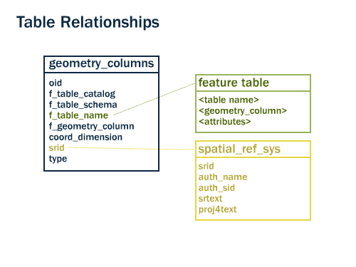

View geometry columns:

```SQL
SELECT * FROM geometry_columns;
```

Our example table contains a mixture of different geometry types. We can collect general information about each object using functions that read the geometry metadata.

* `ST_GeometryType(geometry)`: returns the type of the geometry.
* `ST_NDims(geometry)`: returns the number of dimensions of the geometry.
* `ST_SRID(geometry)`: returns the spatial reference identifier number of the geometry.


```SQL
SELECT name, ST_GeometryType(geom), ST_NDims(geom), ST_SRID(geom)
  FROM geometries;
```

#### Point
A **spatial point** represents a single location on the Earth.
* A point is represented by a single coordinate (including either 2-, 3- or 4-dimensions).
* Points are used to represent objects when the exact details, such as shape and size, are not important at the target scale. For example, cities on a map of the world can be described as points, while a map of a single state might represent cities as polygons.


Introducing point:
```SQL
SELECT ST_AsText(geom)
  FROM geometries
  WHERE name = 'Point';  
```

Functions which apply to points:
```SQL
SELECT ST_X(geom), ST_Y(geom)
  FROM geometries
  WHERE name = 'Point';
```
```SQL
SELECT name, ST_AsText(geom)
  FROM nyc_subway_stations
  LIMIT 1;
```
#### Linestring
A **linestring** is a path between locations.
* It takes the form of an ordered series of two or more points.
* Roads and rivers are typically represented as linestrings.
* A linestring is said to be closed if it starts and ends on the same point.
* It is said to be simple if it does not cross or touch itself (except at its endpoints if it is closed).
* A linestring can be both closed and simple.


Introducing Linestring:
```SQL
SELECT ST_AsText(geom)
  FROM geometries
  WHERE name = 'Linestring';
```

Functions which apply to linestrings:
```SQL
SELECT ST_Length(geom)
  FROM geometries
  WHERE name = 'Linestring';
```

#### Polygons
A **polygon** is a representation of an area.
* The outer boundary of the polygon is represented by a ring.
* This ring is a linestring that is both closed and simple as defined above.
* Holes within the polygon are also represented by rings.

Polygons are used to represent objects whose size and shape are important. City limits, parks, building footprints or bodies of water are all commonly represented as polygons when the scale is sufficiently high to see their area. Roads and rivers can sometimes be represented as polygons.


Introducing polygon:
```SQL
SELECT ST_AsText(geom)
  FROM geometries
  WHERE name LIKE 'Polygon%';
```

Functions which apply to polygons:
```SQL
SELECT name, ST_Area(geom)
  FROM geometries
  WHERE name LIKE 'Polygon%';
```

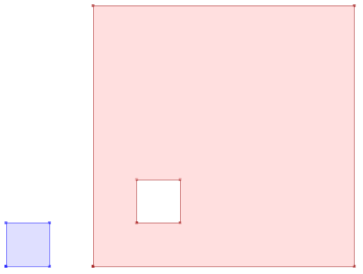

### Collections
There are four collection types, which group multiple simple geometries into sets.
* MultiPoint, a collection of points.
* MultiLineString, a collection of linestrings.
* MultiPolygon, a collection of polygons GeometryCollection, a heterogeneous collection of any geometry (including other collections).

Collections are another concept that shows up in GIS software more than in generic graphics software. They are useful for directly modeling real world objects as spatial objects. 

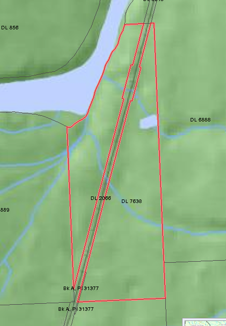

Introducing geometry collections:
```SQL
SELECT name, ST_AsText(geom)
  FROM geometries
  WHERE name = 'Collection';
```

Functions which apply to collections:
```SQL
SELECT ST_NumGeometries(geometry)
  FROM geometries
  WHERE name = 'Linestring';
```

### Geometry I/O

```SQL
SELECT encode(
  ST_AsBinary(ST_GeometryFromText('LINESTRING(0 0,1 0)')),
  'hex');
  ```
```SQL
SELECT ST_AsText(ST_GeometryFromText('LINESTRING(0 0 0,1 0 0,1 1 2)'));
```

Try as GeoJSON, GML and KML(srid):
```SQL
SELECT ST_AsGeoJSON(ST_GeometryFromText('LINESTRING(0 0 0,1 0 0,1 1 2)'));
SELECT ST_AsGML(ST_GeometryFromText('LINESTRING(0 0 0,1 0 0,1 1 2)'));
```

Check the [function list](###geometry-function-list).

### Querying geometry in our dataset

Let's go back to our dataset and start asking some geometry questions?

*What is the area of the ‘West Village’ neighborhood?*
```SQL
SELECT ST_Area(geom)
  FROM nyc_neighborhoods
  WHERE name = 'West Village';
```

*What is the area of West Village in Km?*

*How many census blocks in New York City have a hole in them?*
```SQL
SELECT Count(*)
  FROM nyc_census_blocks
  WHERE ST_NumInteriorRings(ST_GeometryN(geom,1)) > 0;
```

*What is the total length of streets (in kilometers) in New York City?
```SQL
SELECT Sum(ST_Length(geom)) / 1000
  FROM nyc_streets;  
```

*How long is ‘Columbus Cir’ (Columbus Circle)?*

*What is the length of streets in New York City, summarized by type?*
```SQL
SELECT type, Sum(ST_Length(geom)) AS length
FROM nyc_streets
GROUP BY type
ORDER BY length DESC;
```

## Spatial relationships

[Spatial Relationships]

### Equality (ST_Equals)


```SQL
SELECT name, geom, ST_AsText(geom)
FROM nyc_subway_stations
WHERE name = 'Broad St';
```

*What is the name of the subway station with this geometry (0101000020266900000EEBD4CF27CF2141BC17D69516315141)?*

```SQL
SELECT name
FROM nyc_subway_stations
WHERE ST_Equals(geom, '0101000020266900000EEBD4CF27CF2141BC17D69516315141');
```

### Intersection (ST_Intersects)

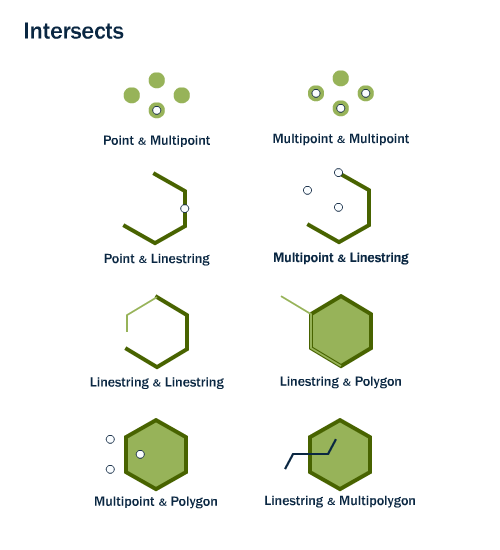

*What is the neighbourhood of Broad St station?*

Get geometry of subway station:
```SQL
SELECT name, ST_AsText(geom)
FROM nyc_subway_stations
WHERE name = 'Broad St';
```

Pass the geometry to the query:
```SQL
SELECT name, boroname
FROM nyc_neighborhoods
WHERE ST_Intersects(geom, ST_GeomFromText('POINT(583571 4506714)',26918));
```

### Distance (ST_Distance)

```SQL
SELECT ST_Distance(
  ST_GeometryFromText('POINT(0 5)'),
  ST_GeometryFromText('LINESTRING(-2 2, 2 2)'));
```

### Whithin (ST_DWithin)

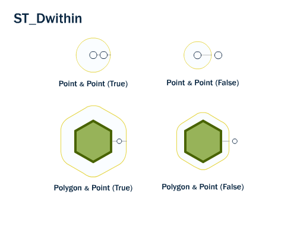

```SQL
SELECT name
FROM nyc_streets
WHERE ST_DWithin(
        geom,
        ST_GeomFromText('POINT(583571 4506714)',26918),
        10
      );
```
Check the [function list](###spatial-relationship-function-list).

### Spatial relationship exercises

*What is the geometry value for the street named ‘Atlantic Commons’?*

*What neighborhood and borough is Atlantic Commons in?*

*What streets does Atlantic Commons join with?*

*Approximately how many people live on (within 50 meters of) Atlantic Commons?*

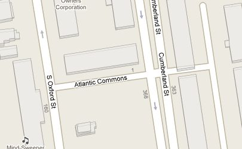


## Spatial joins
[Spatial Joins]

*Which neighborhood is the ‘Broad St’ station in?*

In the previous section, we explored spatial relationships using a two-step process: first we extracted a subway station point for ‘Broad St’; then, we used that point to ask further questions such as “what neighborhood is the ‘Broad St’ station in?”

Using a spatial join, we can answer the question in one step, retrieving information about the subway station and the neighborhood that contains it:

```SQL
SELECT
  subways.name AS subway_name,
  neighborhoods.name AS neighborhood_name,
  neighborhoods.boroname AS borough
FROM nyc_neighborhoods AS neighborhoods
JOIN nyc_subway_stations AS subways
ON ST_Contains(neighborhoods.geom, subways.geom)
WHERE subways.name = 'Broad St';
```

Join and summarize:

The combination of a JOIN with a GROUP BY provides the kind of analysis that is usually done in a GIS system.

*What is the population and racial make-up of the neighborhoods of Manhattan?*
```SQL
SELECT
  neighborhoods.name AS neighborhood_name,
  Sum(census.popn_total) AS population,
  100.0 * Sum(census.popn_white) / Sum(census.popn_total) AS white_pct,
  100.0 * Sum(census.popn_black) / Sum(census.popn_total) AS black_pct
FROM nyc_neighborhoods AS neighborhoods
JOIN nyc_census_blocks AS census
ON ST_Intersects(neighborhoods.geom, census.geom)
WHERE neighborhoods.boroname = 'Manhattan'
GROUP BY neighborhoods.name
ORDER BY white_pct DESC;
```

Let’s explore the racial geography of New York using distance queries.
First, let’s get the baseline racial make-up of the city.
```SQL
SELECT
  100.0 * Sum(popn_white) / Sum(popn_total) AS white_pct,
  100.0 * Sum(popn_black) / Sum(popn_total) AS black_pct,
  Sum(popn_total) AS popn_total
FROM nyc_census_blocks;
```

```SQL
SELECT DISTINCT routes FROM nyc_subway_stations;
```

```SQL
SELECT DISTINCT routes
FROM nyc_subway_stations AS subways
WHERE strpos(subways.routes,'A') > 0;
```

Let’s summarize the racial make-up of within 200 meters of the A-train line.

```SQL
SELECT
  100.0 * Sum(popn_white) / Sum(popn_total) AS white_pct,
  100.0 * Sum(popn_black) / Sum(popn_total) AS black_pct,
  Sum(popn_total) AS popn_total
FROM nyc_census_blocks AS census
JOIN nyc_subway_stations AS subways
ON ST_DWithin(census.geom, subways.geom, 200)
WHERE strpos(subways.routes,'A') > 0;
```

How does this compare with the racial make-up of the city?

### Advanced joins
In the last section we saw that the A-train didn’t serve a population that differed much from the racial make-up of the rest of the city. Let's ask a different question:

*Are there any trains that have a non-average racial make-up?*

Create table with subway lines:
```SQL
CREATE TABLE subway_lines ( route char(1) );
INSERT INTO subway_lines (route) VALUES
  ('A'),('B'),('C'),('D'),('E'),('F'),('G'),
  ('J'),('L'),('M'),('N'),('Q'),('R'),('S'),
  ('Z'),('1'),('2'),('3'),('4'),('5'),('6'),
  ('7');
```
Evaluate the racial make-up, grouped by line route:
```SQL
SELECT
  lines.route,
  100.0 * Sum(popn_white) / Sum(popn_total) AS white_pct,
  100.0 * Sum(popn_black) / Sum(popn_total) AS black_pct,
  Sum(popn_total) AS popn_total
FROM nyc_census_blocks AS census
JOIN nyc_subway_stations AS subways
ON ST_DWithin(census.geom, subways.geom, 200)
JOIN subway_lines AS lines
ON strpos(subways.routes, lines.route) > 0
GROUP BY lines.route
ORDER BY black_pct DESC;
```

### Spatial join exercises

*Which subway station is in ‘Little Italy’? What subway route is it on?*

*What are all the neighborhoods served by the 6-train? (Hint: The routes column in the nyc_subway_stations table has values like ‘B,D,6,V’ and ‘C,6’)*

*After 9/11, the ‘Battery Park’ neighborhood was off limits for several days. How many people had to be evacuated?*

*What is the population density (people / km^2) of the ‘Upper West Side’ and ‘Upper East Side’?” (Hint: There are 1000000 m^2 in one km^2.)*


## Spatial indexes
[Spatial indexes]

Describe nyc_census_blocks table, to view index.

Drop index:
```SQL
DROP INDEX nyc_census_blocks_geom_idx;
```
Describe nyc_census_blocks table again.

We are going to run a query without the index, to notice the difference.

Explain query:
```SQL
EXPLAIN ANALYSE
SELECT blocks.blkid
 FROM nyc_census_blocks blocks
 JOIN nyc_subway_stations subways
 ON ST_Contains(blocks.geom, subways.geom)
 WHERE subways.name = 'Broad St';
```
Run query.

Now let's try with the index. Add index.
```SQL
CREATE INDEX nyc_census_blocks_geom_idx
  ON nyc_census_blocks
  USING GIST (geom);
```

Describe nyc_census_blocks table, to view index.
Re-run query.

Analyse: help the query planner:
```SQL
ANALYZE nyc_census_blocks;
```

Vacuuming:
```SQL
VACUUM ANALYZE nyc_census_blocks;
```

## Projections

Get SRID:
```SQL
SELECT ST_SRID(geom) FROM nyc_streets LIMIT 1;
```

Extend information about the SRID:
```SQL
SELECT * FROM spatial_ref_sys WHERE srid = 26918;
SELECT proj4text FROM spatial_ref_sys WHERE srid = 26918;
```

View SRID:
```SQL
SELECT f_table_name AS name, srid
FROM geometry_columns;
```

Comparing data with a different SRID:
```SQL
SELECT ST_Equals(
         ST_GeomFromText('POINT(0 0)', 4326),
         ST_GeomFromText('POINT(0 0)', 26918)
         );
```

Transforming data:
```SQL
SELECT srtext FROM spatial_ref_sys WHERE srid = 4326;

SELECT ST_AsText(ST_Transform(geom,4326))
FROM nyc_subway_stations
WHERE name = 'Broad St';
```

Update SRID:
```SQL
SELECT UpdateGeometrySRID('geometries','geom',4326);
```

### Projection exercises
*What is the length of all streets in New York, as measured in NAD83 / UTM zone 18N? Hint: this is the current SRID*

*What is the WKT definition of SRID 2831?*

*What is the length of all streets in New York, as measured in SRID 2831?*

*What is the KML representation of the point at ‘Broad St’ subway station?*

### Geography versus geometry

Geographic coordinates are **spherical**, not **cartesian**.


*What happens if we do spatial calculations treating geographic coordinates as cartesian?*

Calculate distance using (unprojected) geometry:
```SQL
SELECT ST_Distance(
  ST_GeometryFromText('POINT(-118.4079 33.9434)', 4326), -- Los Angeles (LAX)
  ST_GeometryFromText('POINT(2.5559 49.0083)', 4326)     -- Paris (CDG)
  );
```

Calculate distance using geography:
```SQL
SELECT ST_Distance(
  ST_GeographyFromText('POINT(-118.4079 33.9434)'), -- Los Angeles (LAX)
  ST_GeographyFromText('POINT(2.5559 49.0083)')     -- Paris (CDG)
  );
```

 *How close will a flight from Los Angeles to Paris come to Iceland?*


```SQL
  SELECT ST_Distance(
  ST_GeographyFromText('LINESTRING(-118.4079 33.9434, 2.5559 49.0083)'), -- LAX-CDG
  ST_GeographyFromText('POINT(-22.6056 63.9850)')                        -- Iceland (KEF)
);
```

If we cross the [international dateline](https://en.wikipedia.org/wiki/International_Date_Line), the cartesian approach applied to geographic coordinates breaks down completely.

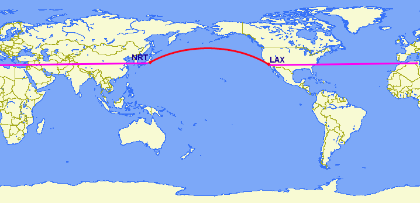

```SQL
SELECT ST_Distance(
  ST_GeometryFromText('Point(-118.4079 33.9434)'),  -- LAX
  ST_GeometryFromText('Point(139.733 35.567)'))     -- NRT (Tokyo/Narita)
    AS geometry_distance,
ST_Distance(
  ST_GeographyFromText('Point(-118.4079 33.9434)'), -- LAX
  ST_GeographyFromText('Point(139.733 35.567)'))    -- NRT (Tokyo/Narita)
    AS geography_distance;
```

[Why not use geography?]

## Geometry construction functions
"Geometry constructing functions" take geometries as inputs and output new shapes.

### ST_Centroid / ST_PointOnSurface
A common need when composing a spatial query is to replace a polygon feature with a point representation of the feature.

* ST_Centroid(geometry) returns a point that is approximately on the center of mass of the input argument. This simple calculation is very fast, but sometimes not desirable, because the returned point is not necessarily in the feature itself. If the input feature has a convexity (imagine the letter ‘C’) the returned centroid might not be in the interior of the feature.
* ST_PointOnSurface(geometry) returns a point that is guaranteed to be inside the input argument. It is substantially more computationally expensive than the centroid operation.

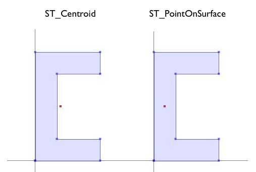

### Buffer


Use case:

If the US Park Service wanted to enforce a marine traffic zone around Liberty Island, they might build a 500 meter buffer polygon around the island. Liberty Island is a single census block in our nyc_census_blocks table, so we can easily extract and buffer it.

Select liberty island's geometry:
```SQL
SELECT gid,geom
FROM nyc_census_blocks
WHERE blkid = '360610001001001';
```
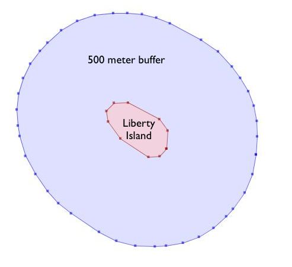

Persist the answer to this question in a table:
```SQL
CREATE TABLE liberty_island_zone AS
SELECT ST_Buffer(geom,500)::geometry(Polygon,26918) AS geom
FROM nyc_census_blocks
WHERE blkid = '360610001001001';
```

We can also create buffers using negative distances:
```SQL
SELECT gid, ST_Buffer(geom,-50)::geometry(Polygon,26918) AS geom
FROM nyc_census_blocks
WHERE blkid = '360610001001001';
```

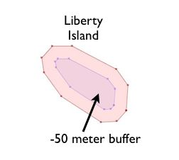

### Intersection and union

Generate intersection geometry:
```SQL
SELECT  1 as ID, (ST_Buffer('POINT(0 0)', 2)) as geom;
SELECT  1 as ID, (ST_Buffer('POINT(3 0)', 2)) as geom;
```
```SQL
SELECT 1 as ID, (ST_Intersection(
  ST_Buffer('POINT(0 0)', 2),
  ST_Buffer('POINT(3 0)', 2)
)) as geom;
```

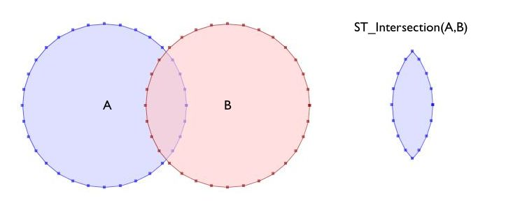

Generate union geometry:
```SQL
SELECT ST_AsText(ST_Union(
  ST_Buffer('POINT(0 0)', 2),
  ST_Buffer('POINT(3 0)', 2)
));
```


Let's go back to our dataset and merge blocks of the census (sharing the first five digits).

Explain query, first:
```SQL
EXPLAIN ANALYSE
SELECT
  ST_Union(geom)::Geometry(MultiPolygon,26918) AS geom,
  SubStr(blkid,1,5) AS countyid
FROM nyc_census_blocks
GROUP BY countyid;
```

Run query:
```SQL
CREATE TABLE nyc_census_counties AS
SELECT
  ST_Union(geom)::Geometry(MultiPolygon,26918) AS geom,
  SubStr(blkid,1,5) AS countyid
FROM nyc_census_blocks
GROUP BY countyid;
```

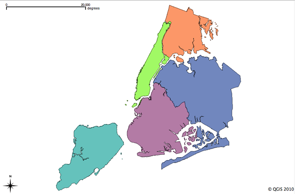

Lets confirm we did not loose geometry
```SQL
SELECT SubStr(blkid,1,5) AS countyid, Sum(ST_Area(geom)) AS area
FROM nyc_census_blocks
GROUP BY countyid;
```

## More spatial joins

### Join attributes to spatial Data

Load [nyc_census_sociodata](./nyc_census_sociodata) through the QGIS UI.

Create census tracts table:
```SQL
CREATE TABLE nyc_census_tract_geoms AS
SELECT
  ST_Union(geom) AS geom,
  SubStr(blkid,1,11) AS tractid
FROM nyc_census_blocks
GROUP BY tractid;
```

Create spatial index:
```SQL
CREATE INDEX nyc_census_tract_geoms_tractid_idx
  ON nyc_census_tract_geoms (tractid);
```

Join Attributes:
```SQL
CREATE TABLE nyc_census_tracts AS
SELECT
  g.geom,
  a.*
FROM nyc_census_tract_geoms g
JOIN nyc_census_sociodata a
ON g.tractid = a.tractid;
```

View in qgis.

[Display  pie charts]

### Spatial join exercise

*List top 10 New York neighborhoods ordered by the proportion of people who have graduate degrees.*

## Homework
Do a similar analysis for the income. Try answering this question with one,or more queries:

*what are the top neigbourhoods in NY where people have the best income?*

Represent the results on the map.

# License
This work, "Introduction to Spatial Queries", is a derivative of "Introduction to PostGIS" by Boundless, used under Creative Commons Attribution-Share Alike 3.0. "Introduction to Spatial Queries" is licensed under CC BY by [@doublebyte1](https://github.com/doublebyte1/).

## Reference Information
### Geometry Function List

ST_Area: Returns the area of the surface if it is a polygon or multi-polygon. For “geometry” type area is in SRID units. For “geography” area is in square meters.

ST_AsText: Returns the Well-Known Text (WKT) representation of the geometry/geography without SRID metadata.

ST_AsBinary: Returns the Well-Known Binary (WKB) representation of the geometry/geography without SRID meta data.

ST_EndPoint: Returns the last point of a LINESTRING geometry as a POINT.

ST_AsEWKB: Returns the Well-Known Binary (WKB) representation of the geometry with SRID meta data.

ST_AsEWKT: Returns the Well-Known Text (WKT) representation of the geometry with SRID meta data.

ST_AsGeoJSON: Returns the geometry as a GeoJSON element.

ST_AsGML: Returns the geometry as a GML version 2 or 3 element.

ST_AsKML: Returns the geometry as a KML element. Several variants. Default version=2, default precision=15.

ST_AsSVG: Returns a Geometry in SVG path data given a geometry or geography object.

ST_ExteriorRing: Returns a line string representing the exterior ring of the POLYGON geometry. Return NULL if the geometry is not a polygon. Will not work with MULTIPOLYGON

ST_GeometryN: Returns the 1-based Nth geometry if the geometry is a GEOMETRYCOLLECTION, MULTIPOINT, MULTILINESTRING, MULTICURVE or MULTIPOLYGON. Otherwise, return NULL.

ST_GeomFromGML: Takes as input GML representation of geometry and outputs a PostGIS geometry object.

ST_GeomFromKML: Takes as input KML representation of geometry and outputs a PostGIS geometry object

ST_GeomFromText: Returns a specified ST_Geometry value from Well-Known Text representation (WKT).

ST_GeomFromWKB: Creates a geometry instance from a Well-Known Binary geometry representation (WKB) and optional SRID.

ST_GeometryType: Returns the geometry type of the ST_Geometry value.

ST_InteriorRingN: Returns the Nth interior linestring ring of the polygon geometry. Return NULL if the geometry is not a polygon or the given N is out of range.

ST_Length: Returns the 2d length of the geometry if it is a linestring or multilinestring. geometry are in units of spatial reference and geography are in meters (default spheroid)

ST_NDims: Returns coordinate dimension of the geometry as a small int. Values are: 2,3 or 4.

ST_NPoints: Returns the number of points (vertexes) in a geometry.

ST_NRings: If the geometry is a polygon or multi-polygon returns the number of rings.

ST_NumGeometries: If geometry is a GEOMETRYCOLLECTION (or MULTI*) returns the number of geometries, otherwise return NULL.

ST_Perimeter: Returns the length measurement of the boundary of an ST_Surface or ST_MultiSurface value. (Polygon, Multipolygon)

ST_SRID: Returns the spatial reference identifier for the ST_Geometry as defined in spatial_ref_sys table.

ST_StartPoint: Returns the first point of a LINESTRING geometry as a POINT.

ST_X: Returns the X coordinate of the point, or NULL if not available. Input must be a point.

ST_Y: Returns the Y coordinate of the point, or NULL if not available. Input must be a point.

### Spatial Relationship Function List

ST_Contains(geometry A, geometry B): Returns true if and only if no points of B lie in the exterior of A, and at least one point of the interior of B lies in the interior of A.

ST_Crosses(geometry A, geometry B): Returns TRUE if the supplied geometries have some, but not all, interior points in common.

ST_Disjoint(geometry A , geometry B): Returns TRUE if the Geometries do not “spatially intersect” - if they do not share any space together.

ST_Distance(geometry A, geometry B): Returns the 2-dimensional cartesian minimum distance (based on spatial ref) between two geometries in projected units.

ST_DWithin(geometry A, geometry B, radius): Returns true if the geometries are within the specified distance (radius) of one another.

ST_Equals(geometry A, geometry B): Returns true if the given geometries represent the same geometry. Directionality is ignored.

ST_Intersects(geometry A, geometry B): Returns TRUE if the Geometries/Geography “spatially intersect” - (share any portion of space) and FALSE if they don’t (they are Disjoint).

ST_Overlaps(geometry A, geometry B): Returns TRUE if the Geometries share space, are of the same dimension, but are not completely contained by each other.

ST_Touches(geometry A, geometry B): Returns TRUE if the geometries have at least one point in common, but their interiors do not intersect.

ST_Within(geometry A , geometry B): Returns true if the geometry A is completely inside geometry B

